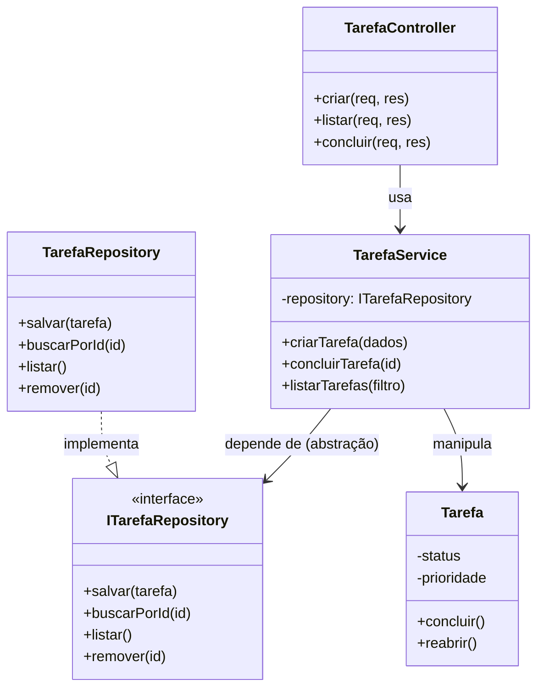

# Modelagem do Domínio — To-Do List

Este documento formaliza a modelagem inicial do projeto, aplicando **SRP** (Single Responsibility Principle) e indicando onde aplicar **DIP** (Dependency Inversion Principle).

## 1. Classes do domínio (revisadas)

Em relação ao rascunho do README, algumas responsabilidades foram separadas para respeitar SRP — por exemplo, `ListaDeTarefas` deixou de concentrar regra de negócio *e* acesso a dados: isso agora é dividido entre `TarefaService` (regra) e `TarefaRepository` (persistência).

| Classe/Interface       | Tipo         | Responsabilidade única                                              |
|-------------------------|--------------|-----------------------------------------------------------------------|
| `Tarefa`                 | Entidade     | Representar o estado de uma tarefa (título, status, prioridade, categoria) e garantir que suas próprias transições sejam válidas (`concluir()`, `reabrir()`) |
| `Categoria`               | Entidade     | Representar uma categoria (nome, cor) — nada além disso |
| `Usuario`                 | Entidade     | Representar dados de identidade do usuário (nome, e-mail) |
| `ITarefaRepository`       | Abstração (interface) | Definir o contrato de persistência: `salvar`, `buscarPorId`, `listar`, `remover` — sem saber *como* isso é feito |
| `TarefaRepository`        | Implementação | Persistir tarefas de um jeito concreto (ex: em memória, ou depois em arquivo/banco) — implementa `ITarefaRepository` |
| `TarefaService`           | Serviço (regra de negócio) | Orquestrar casos de uso: criar tarefa, concluir tarefa, filtrar por categoria/status — depende de `ITarefaRepository`, nunca da implementação concreta |
| `TarefaController`        | Controller (Express) | Traduzir requisição HTTP ↔ chamada ao `TarefaService`. Não conhece regra de negócio nem forma de persistência |

### Por que essa separação respeita SRP

Cada motivo de mudança vive em uma classe separada:

- Mudou a regra de negócio (ex: "tarefa concluída não pode ser reaberta") → só mexe em `TarefaService`.
- Mudou onde os dados são guardados (memória → banco) → só mexe em `TarefaRepository`.
- Mudou o formato da API (ex: paginação) → só mexe em `TarefaController`.

## 2. Onde aplicar DIP

O princípio da Inversão de Dependência diz que módulos de alto nível (regra de negócio) não devem depender de módulos de baixo nível (detalhes de implementação) — ambos devem depender de abstrações.



**Leitura do diagrama:**

- `TarefaService` (alto nível) **não** aponta para `TarefaRepository` (baixo nível) diretamente — aponta para a interface `ITarefaRepository`.
- `TarefaRepository` (implementação concreta) é quem implementa essa interface.
- Isso permite trocar `TarefaRepository` (em memória) por uma versão com banco de dados **sem alterar uma linha** de `TarefaService`.
- Na prática em Node/Express, a "injeção" acontece passando a instância do repositório no construtor do serviço:

```js
const service = new TarefaService(new TarefaRepository());
```
